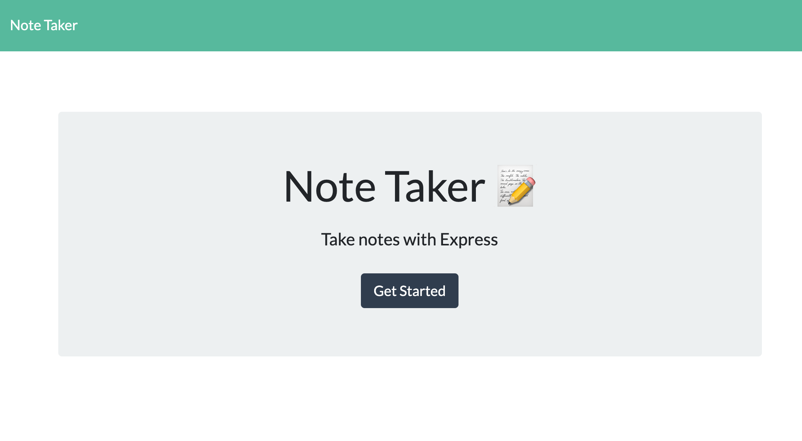
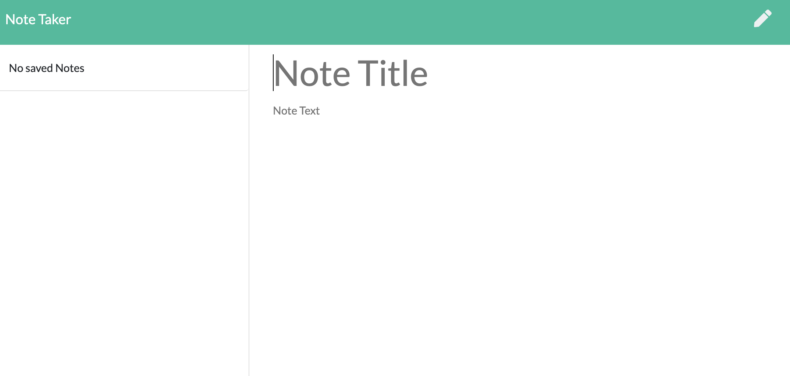
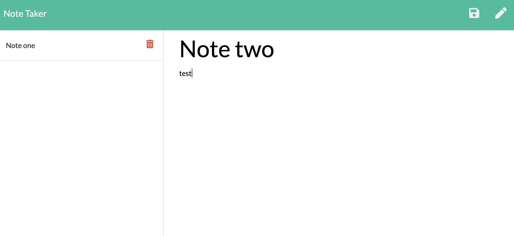

  
#Note Taker

## Description
This is an application that can be used to write, save, and delete notes.

## Table of Contents 
* [Installation](#installation)
* [Usage](#usage)
* [Credits](#credits)
* [MIT License](#MIT-License)
* [Contributing](#Contributing)

## Installation
If you want to use it with your own server you will have to clone this repository and run "node server.js. Otherwise, you can just click on the link for the deployed app and try it out!

[Deployed application here](https://safe-citadel-95626.herokuapp.com/notes)

## Usage 
You can use this app to store your notes.  They will persist there for as long as the server is running.

## Test Instructions

No tests at the moment.

## MIT License

This project is licensed under the MIT license.

## Contributing

No collaborators at this time but you are more than welcome to improve it!

## Questions

If you have any questions pleae direct them to my email address: diegocordoba87@gmail.com or contact me via GitHub here: 
https://github.com/diegocordoba87
 
